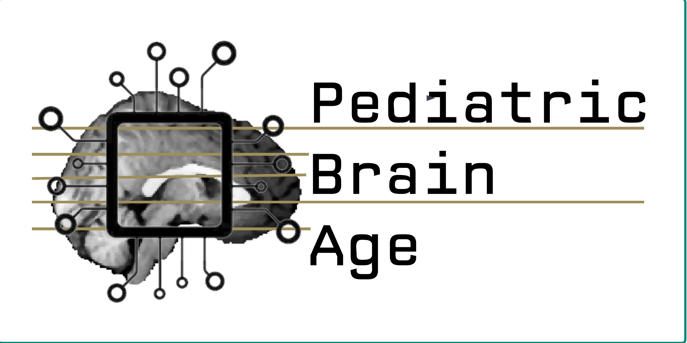

<p align="center">
     
</p>

# Diffusion Deep Learning for Brain Age Prediction and Longitudinal Tracking in Children through Adulthood
[What is this about?](https://guessmybrainage.webflow.io/)

Here, we leveraged 32,851 T1-weighted MRI scans(Fig A) from healthy children and adolescents aged 3 to 30 from 16 multisite datasets to develop and evaluate several DL brain age frameworks, including a novel regression diffusion deep learning network (AgeDiffuse, Fig B). On multisite, external validation (5 datasets), we found that AgeDiffuse outperformed conventional deep learning frameworks, with a mean absolute error (MAE) of 2.78 years (IQR=[1.2-3.9], Fig C). In a second, separate external validation (3 datasets) AgeDiffuse yielded MAE 1.97 years (IQR=[0.8-2.8]). We found that AgeDiffuse brain age predictions were associated with age-related brain structure volume changes. Finally, we found that longitudinal predicted brain age tracked closely with chronological age at the individual level. 

If you publish any work that uses this package, please cite the following publication: [Paper](https://direct.mit.edu/imag/article/doi/10.1162/imag_a_00114/119916)


**Not intended for clinical use.**

## Hardware requirements
This repository was developed and tested on the following hardware:
- Ubuntu 22.04.1 LTS, 1x Nvidia RTX A6000 GPU

## Quick Start - No Docker (single MRI T1 inference)
**Prerequisites: conda, gpu, cuda drivers** 

1. Clone repo `git clone`

2. To create an enviroment, run: 
`conda env create -f environment.yml`

3. To activate the enviroment:
`conda activate pba`

5. Download model weights from [link](https://drive.google.com/file/d/1RC4lB2_qTP8tjVkoOpB74-KjCTujY8pt/view?usp=sharing) (12 GB), unzip and place into /model_weights path.

5. For demo on TM pipeline launch jupyter notebook `notebooks/demo_notebook.ipynb` inside conda enviroment. Estimated inference time: 5 minutes (on Nvidia RTX A6000 GPU)

## Quick Start - Docker(single MRI T1 inference), estimated time for set up: 10-15 minutes

**Prerequisites: conda, gpu, docker** 
1. Clone repo `git clone`

2. To build a docker:
`docker build -t pba . `

3. To run docker on example MRI:
`docker run -it --gpus X -v ${PWD}/output:/output/ -v ${PWD}/model_weights:/model_weights/ pba --chronological_age Y`
- Y is chronological age in years (example: 10.4)
- output is the path to the output folder where the results will be saved
- model_weights is the path to the folder with model weights
- X gpu id to use (example: 0)


## Jupiter notebook inference demo (no docker needed) 
**Prerequisites: conda, gpu** 

0. Create enviroment:
```
conda env create -f environment.yml
conda activate brain-age
```

1. Run the notebook:
```
jupyter notebook 
```
And navigate to `notebooks/Demo-notebook.ipynb`


## Things To-Do:
- [ ] retraining on your own MRI dataset how-to
- [ ] batched inference
- [X] create docker
- [ ] create CPU-only inference and docker
- [ ] replace itk-registration with cmd line version / or use updated sitk module


## Acknowledgements
- [DiffMIC: Dual-Guidance Diffusion Network for Medical Image Classification](https://arxiv.org/abs/2303.10610).
- [XzwHan/CARD](https://github.com/XzwHan/CARD)
- [CompVis/stable-diffusion](https://github.com/CompVis/stable-diffusion)
- [MedSegDiff](https://github.com/WuJunde/MedSegDiff/tree/master)
- [nyukat/GMIC](https://github.com/nyukat/GMIC)
- [HDBET](https://github.com/MIC-DKFZ/HD-BET)


## Cite
If you find this code useful, please cite: [Paper](https://www.medrxiv.org/content/10.1101/2023.10.17.23297166.full.pdf)

## Dataset
For mode details on the dataset, please refer to the following paper: [Paper](https://direct.mit.edu/imag/article/doi/10.1162/imag_a_00114/119916)

### LICENSE: CC BY-NC 4.0

This work is licensed under the Creative Commons Attribution-NonCommercial 4.0 International License.
To view a copy of this license, visit <http://creativecommons.org/licenses/by-nc/4.0/> or send a letter to Creative Commons, PO Box 1866, Mountain View, CA 94042, USA.
Copyright (c) [2023] [Diffusion Deep Learning for Brain Age Prediction and Longitudinal Tracking in Children though Adulthood]


